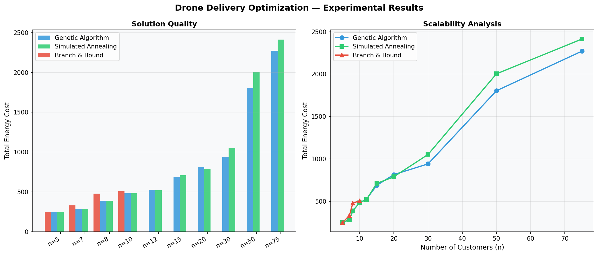
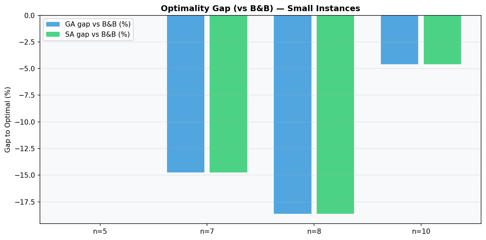
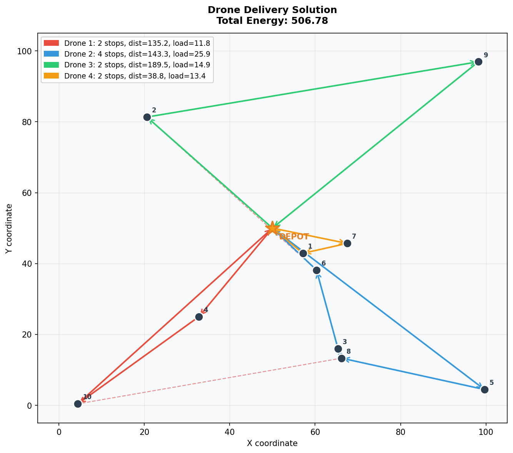
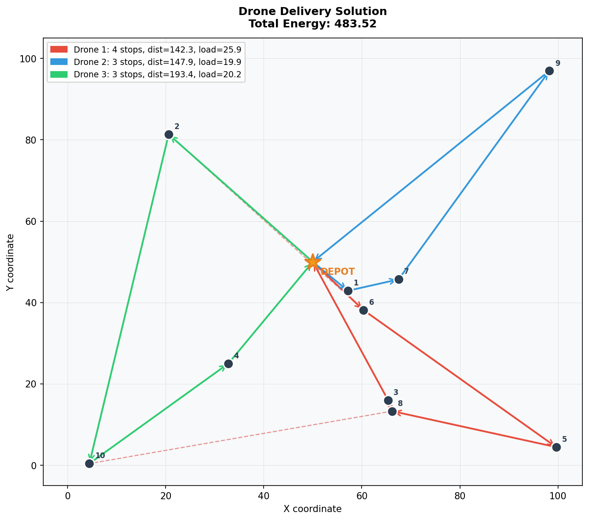
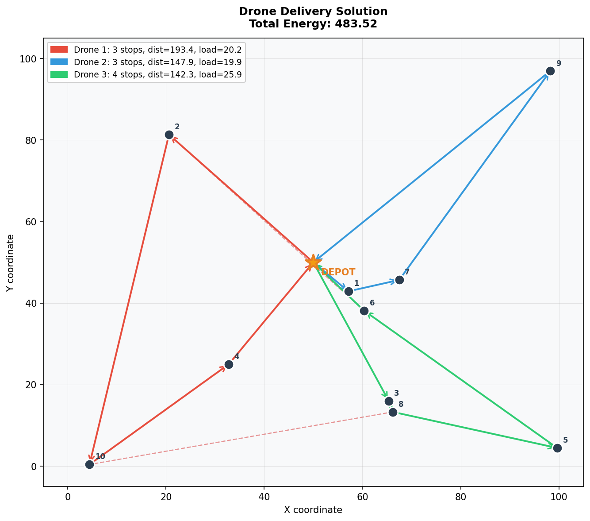
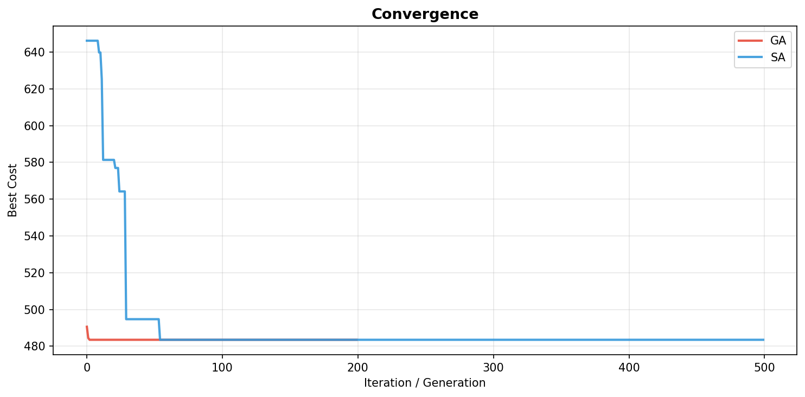
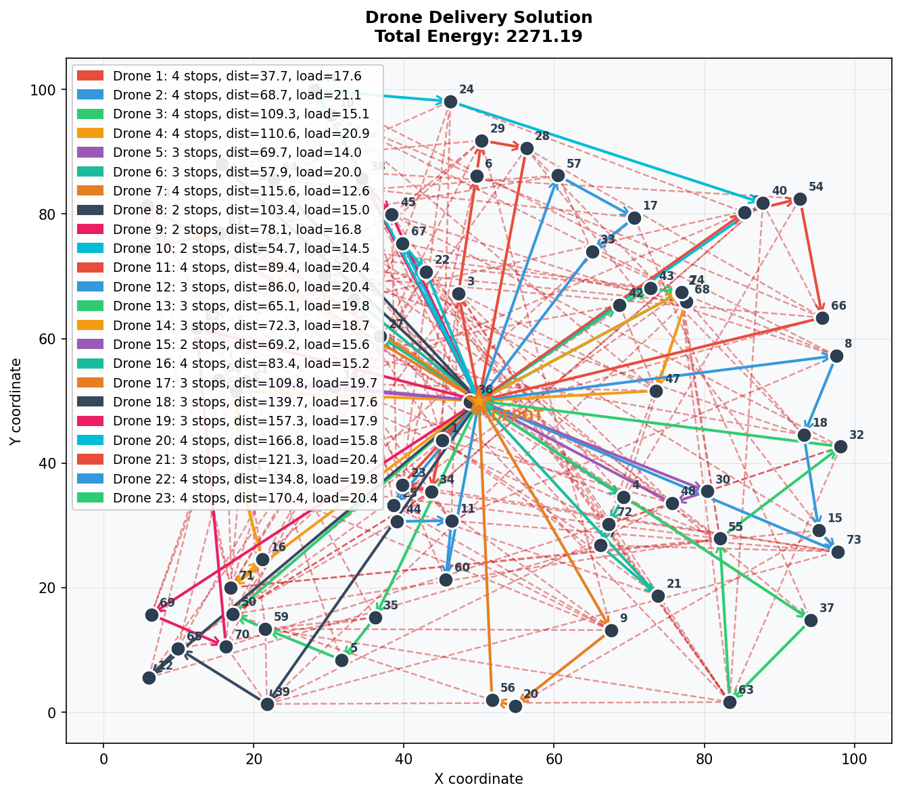
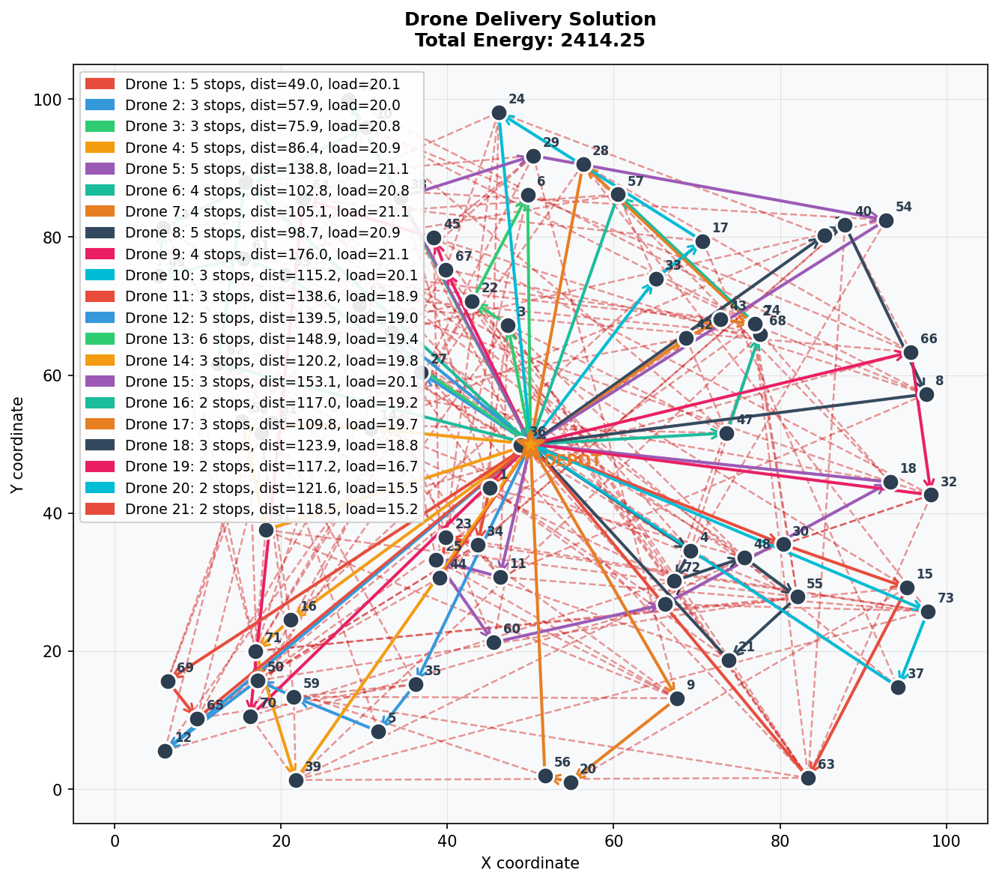

# Drone-Based Delivery Optimization Problem
## ENSIA – Third Year – Combinatorial Optimization and Metaheuristics – 2026

---

## Project Structure

```
drone_delivery_project/
├── README.md                        ← This file
├── requirements.txt                 ← Python dependencies
├── run_experiments.py               ← Main experiment runner
├── instances/                       ← Generated test instances (JSON)
├── results/                         ← Output CSV + plots
├── report/
│   └── formulations.md              ← Mathematical formulations (LaTeX-ready)
└── src/
    ├── utils/
    │   ├── instance_generator.py    ← Random instance generator
    │   ├── data_structures.py       ← Problem data classes
    │   └── visualizer.py            ← Route visualization
    ├── exact/
    │   └── branch_and_bound.py      ← B&B exact solver
    └── metaheuristics/
        ├── genetic_algorithm.py     ← Population-based metaheuristic
        └── simulated_annealing.py   ← Local search metaheuristic
```

---

## Problem Summary

A fleet of drones must deliver packages from a central **depot** (node 0) to a set of **customers**. This is a variant of the Capacitated Vehicle Routing Problem (CVRP). Each drone:
- Starts and ends at the depot
- Has a **battery capacity** (max total distance per route)
- Has a **payload capacity** (max total weight per route)

**Objective**: Minimize total energy consumption (proportional to total distance flown).

**No-fly zones** are modeled as forbidden edges (infinite cost / removed from the graph).

DDOP is proven **NP-Hard** via a polynomial reduction from Bin Packing (see `report/formulations.md`).

### Mathematical Formulations

- **Arc-flow MILP** — classical CVRP-style model with MTZ subtour elimination constraints (`O(n²K)` binary variables).
- **Set-partitioning / flow model** — route-level formulation, no subtour constraints, natural for column generation (`O(|R|)` variables).

---

## How to Run

### 1. Install dependencies
```bash
pip install -r requirements.txt
```

### 2. Generate instances
```bash
python run_experiments.py --mode generate
```

### 3. Run all solvers on all instances
```bash
python run_experiments.py --mode solve
```

### 4. Run a quick demo (one instance, all solvers)
```bash
python run_experiments.py --mode demo --instance instances/instance_01.json
```

### 5. Full experiment + plots
```bash
python run_experiments.py --mode full
```

---

## Assumptions

| Parameter | Value / Model |
|-----------|---------------|
| Energy consumption | Proportional to Euclidean distance: `E = d × weight_factor` |
| Weight factor | 1.0 (uniform energy per unit distance) |
| Depot | Node index 0, located at (50, 50) in a 100×100 grid |
| Customer positions | Uniformly random in [0,100]² |
| Demand per customer | Uniform in [1, 10] kg |
| Battery capacity | Scales with instance size (see generator) |
| Payload capacity | 30 kg per drone |
| No-fly zones | Random rectangular forbidden zones |

---

## Methods Implemented

| Method | Type | Notes |
|--------|------|-------|
| Branch & Bound | Exact | Assignment-relaxation lower bound, greedy NN upper bound init. Tractable for n ≲ 12. |
| Genetic Algorithm | Population-based | Giant Tour encoding, Order Crossover (OX), adaptive mutation, embedded Or-opt local search, elitism. |
| Simulated Annealing | Local search | Explicit route representation, 4 neighborhood operators (2-opt, Or-opt relocation, cross-exchange, route merge), geometric cooling with reheating. |

---

## Results

Benchmarked on 10 instances (n = 5 to 75 customers).

- GA and SA match or beat B&B on small instances within B&B's time budget.
- SA is competitive with GA for n ≤ 20.
- **GA outperforms SA by 10–15% on large instances (n ≥ 30)**, thanks to population diversity and embedded Or-opt local search.

| n | B&B | GA | SA |
|---|---|---|---|
| 5 | 248.96 | 248.96 | 248.96 |
| 10 | 506.78 | 483.52 | 483.52 |
| 30 | N/A | 941.52 | 1052.90 |
| 75 | N/A | 2271.19 | 2414.25 |

### Charts




### Example Routes & Convergence

**Small instance (n=10)** — B&B vs GA vs SA, and convergence curves:






**Large instance (n=75)** — GA vs SA (B&B not tractable at this size):




> All per-instance route plots and convergence curves for the remaining instances (n=5,7,8,12,15,20,30,50) are in `results/`, following the same `instance_XX_nY_s0_<method>.png` naming.

---

## Authors

Hamza Faiz Ahmed Fouatih, Youcef Belaib, Dhiaa Eddine Zeroual, Ishak Dib — ENSIA, Department of Intelligent Systems Engineering.

## Complexity

The Drone Delivery Problem is a variant of the **Capacitated Vehicle Routing Problem (CVRP)**,
which is **NP-Hard** (reduction from bin-packing / TSP).
Exact methods are feasible only for small instances (n ≤ 15).
